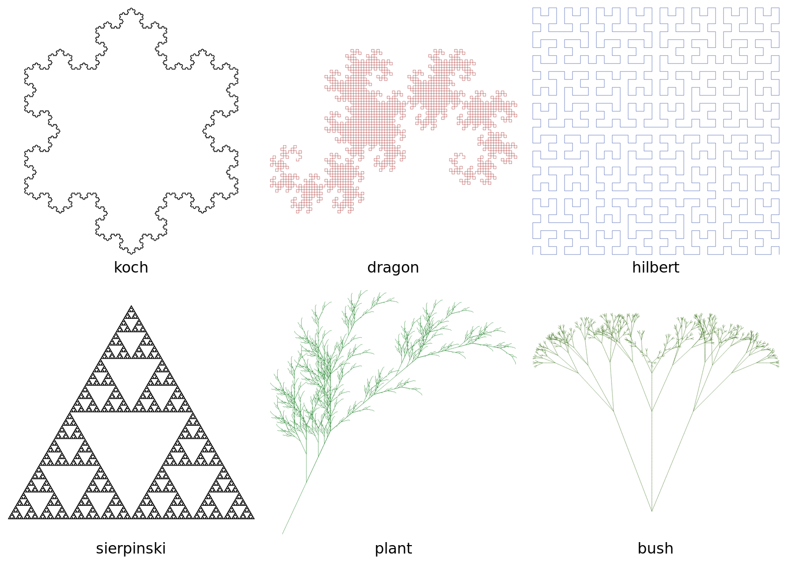

# GPU-Accelerated L-Systems for Botanical Structures

GPU-accelerated [L-system](https://en.wikipedia.org/wiki/L-system) evaluation and
rendering. An L-system rewrites a string of symbols under a set of
production rules, and a turtle interpreter then walks the resulting string to emit line
segments, which are rasterized. The exponential string rewriting, turtle transform
accumulation, and rasterization can run entirely on the GPU.

## Demo

Generated images with `make render`:



Note that `plant` and `bush` are both bracketed L-systems and `bush` is three dimensional.

A full [demo recording](./figs/demo.mp4) of `make playground` is available!

## Installation

The code was compiled on a CUDA capable GPU (RTX A5000). The nix flake will pin the
rest of the toolchain, but the `CMakeList` is enough to build the project on any CUDA system.

```bash
git clone https://github.com/ericlovesmath/Lindenmeyer-System-CUDA.git
cd Lindenmeyer-System-CUDA
git submodule update --init  # imgui
make build
```

## Usage

- `make build`: Configure + build all targets into `build/`
- `make render`: writes sample PPMs to `out/`
- `make bench`: CPU vs GPU timing (expand / transform / pipeline)
- `make test`: Runs `ctest`'s
- `make profile`: Generate Nsight Compute profiles
- `make playground`: Interactive ImGui window

Note on running the playground: `./build/playground` needs a real GL context.
On a VNC desktop the GL is usually llvmpipe, which collapses "GPU raster" timing to CPU
speed, do we must run it through VirtualGL to redirect GL to the real GPU with
`vglrun -d egl0 ./build/playground`. This project was tested with IceWM over a TigerVNC server.

## Writeup

- [Original Project Proposal](docs/proposal.pdf)
- [Writeup](docs/WRITEUP.md)
